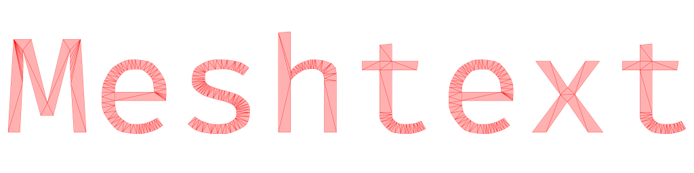

# Meshtext
Meshtext is a font triangulation tool for 3D scenes.

⚠️ Version `0.1` of this crate focuses on correctness and not so much on speed. ⚠️

The idea is to have a feature complete Proof-of-Concept first and then start optimizing.

## Features
* Generates indexed or non-indexed meshes
* Automatically caches glyphs (also supports preloading)
* Flat 2D text (in 3D space) or 3D text
* Supports custom transformation of text sections

## Limitations
* Linebreaks and wrapping must be handled manually
* Does not support bevels, because there is only one depth segment
* There is no support for subscripts and superscripts

## TODO
- [ ] Add a 2D mesh generator where each vertex is composed of two coordinates
- [ ] Implement an optimizer that removes redundant vertices and triangles
- [ ] Add proper benchmarks
- [ ] Optimize for speed
- [ ] Evaluate `no-std` support

## Attribution
- Depends heavily on [`cdt`](https://crates.io/crates/cdt) for triangulation.
- Uses [`ttf-parser`](https://crates.io/crates/ttf-parser) for font loading.
- Uses [`glam`](https://crates.io/crates/glam) for performing basic linear algebra.

## License

All code in this repository is dual-licensed under either:

* MIT License ([LICENSE-MIT](docs/LICENSE-MIT) or [http://opensource.org/licenses/MIT](http://opensource.org/licenses/MIT))
* Apache License, Version 2.0 ([LICENSE-APACHE](docs/LICENSE-APACHE) or [http://www.apache.org/licenses/LICENSE-2.0](http://www.apache.org/licenses/LICENSE-2.0))

at your option.

Unless you explicitly state otherwise, any contribution intentionally submitted
for inclusion in the work by you, as defined in the Apache-2.0 license, shall be dual licensed as above, without any
additional terms or conditions.

## Screenshot

